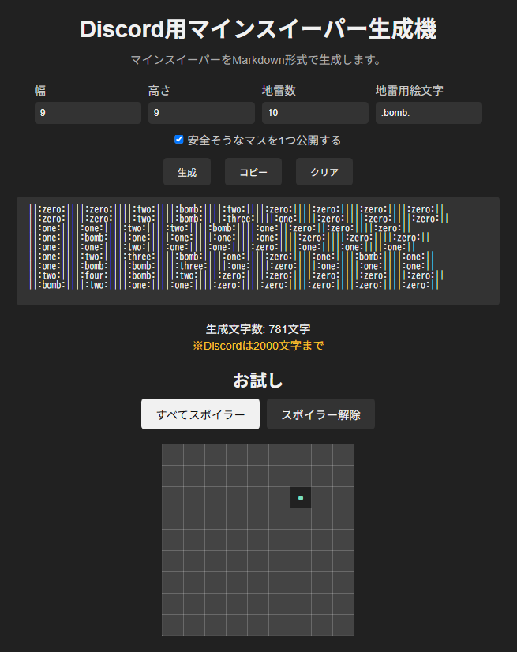

# discord-minesweeper-plus
Discord用マインスイーパー生成機

このリポジトリは [元のリポジトリ](https://github.com/Ibemu/discord-minesweeper) をフォークして、機能追加の目的でカスタマイズしています。

## このフォークの目的

- 新しい機能を追加するため
- 検証や実験のため

## 主な変更点

- レイアウトを刷新
- 地雷を任意の絵文字に変更する機能を追加
- 安全そうなマスを1つ公開する機能を追加
- HTML上でお試しで遊べる機能を追加

## スクリーンショット

以下は実際の動作画面のスクリーンショットです：

## デモ

このプロジェクトのデモは以下で閲覧できます：

👉 [デモサイト](https://brkonic.github.io/discord-minesweeper-plus/)

> ※ GitHub Pages を使用して静的サイトとして公開しています。
